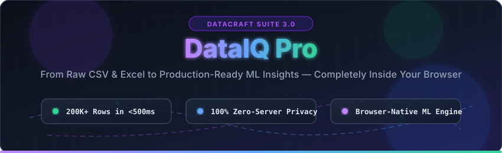
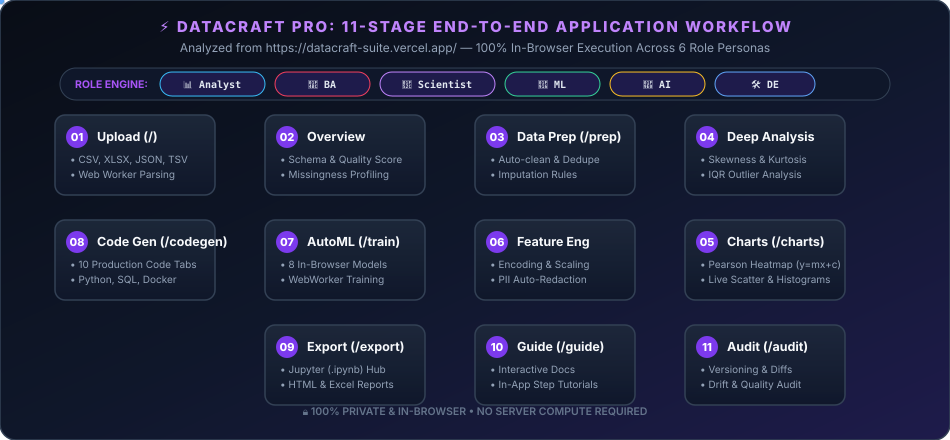
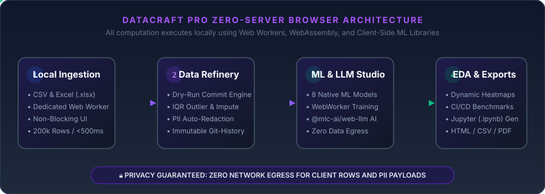
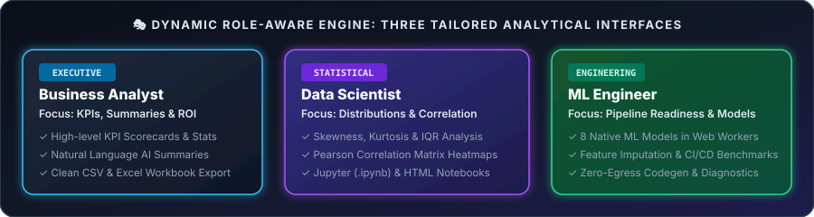

<div align="center">

  <a href="https://github.com/HarshChoudhary2003/datacraft-suite">
    
  </a>

  <br />

  <a href="https://github.com/HarshChoudhary2003/datacraft-suite">
    
  </a>

  <p align="center">
    <strong>From raw CSV &amp; Excel workbooks to production-ready ML insights in seconds.</strong>
    <br />
    <em>A completely local, high-performance Data Analytics, Machine Learning &amp; Cleansing suite built with React 19, TypeScript, TailwindCSS v4, Web Workers, and WebAssembly.</em>
    <br />
    🌐 <strong>Live Application:</strong> <a href="https://datacraft-suite.vercel.app/">https://datacraft-suite.vercel.app/</a>
  </p>

  <p align="center">
    <a href="#-why-dataiq-pro"></a>
    <a href="#-browser-native-machine-learning-studio"></a>
    <a href="#-privacy-first-ai-assistant"></a>
    <a href="#-security-privacy--data-governance"></a>
  </p>

  <p align="center">
    
    
    
    
    
    
    
  </p>
</div>

---

## 📑 Table of Contents

- [🌟 Executive Overview & Why DataIQ Pro](#-executive-overview--why-dataiq-pro)
- [🔄 Complete Animated End-to-End Workflow](#-complete-animated-end-to-end-workflow)
- [🏗️ Zero-Server Architectural Flow](#-zero-server-architectural-flow)
- [🎭 Dynamic 6-Role Persona Engine](#-dynamic-6-role-persona-engine)
- [✨ 11 Comprehensive Application Modules](#-11-comprehensive-application-modules)
  - [📥 01. Ingestion & Multi-Format Parsing (`/`)](#-01-ingestion--multi-format-parsing-)
  - [📊 02. Dataset Overview & Quality Score (`/overview`)](#-02-dataset-overview--quality-score-overview)
  - [🛡️ 03. Data Prep & Quality Validation (`/prep`)](#-03-data-prep--quality-validation-prep)
  - [📈 04. Deep Statistical Analysis (`/analysis`)](#-04-deep-statistical-analysis-analysis)
  - [🎨 05. Interactive Visualization & Pearson EDA (`/charts`)](#-05-interactive-visualization--pearson-eda-charts)
  - [⚙️ 06. Feature Engineering & Transformations (`/transform`)](#-06-feature-engineering--transformations-transform)
  - [🤖 07. AutoML & Browser-Native ML Studio (`/train`)](#-07-automl--browser-native-ml-studio-train)
  - [💻 08. Production Code Generation Hub (`/codegen`)](#-08-production-code-generation-hub-codegen)
  - [📤 09. Universal Export & Notebook Hub (`/export`)](#-09-universal-export--notebook-hub-export)
  - [📚 10. Interactive In-App User Guide (`/guide`)](#-10-interactive-in-app-user-guide-guide)
  - [📜 11. Audit, Telemetry & Versioning (`/audit`)](#-11-audit-telemetry--versioning-audit)
- [⚡ Performance & Latency Benchmarks](#-performance--latency-benchmarks)
- [🚀 Quick Start & Local Setup](#-quick-start--local-setup)
- [🛠️ Complete Command Reference (NPM Scripts)](#-complete-command-reference-npm-scripts)
- [🛡️ Security, Privacy & Data Governance](#-security-privacy--data-governance)
- [📁 Project Anatomy & Directory Map](#-project-anatomy--directory-map)
- [🤝 Contributing Guide](#-contributing-guide)
- [📜 License & Acknowledgments](#-license--acknowledgments)

---

## 🌟 Executive Overview & Why DataIQ Pro

Traditional data science workflows rely heavily on cloud notebooks (Jupyter, Colab, Databricks) that require uploading sensitive spreadsheets and CSVs to remote servers, spinning up Python environments, and paying for compute latency.

**DataIQ Pro (`datacraft-suite`) eliminates the server dependency entirely.** By leveraging modern browser APIs—including **Web Workers**, **Client-Side Machine Learning (`ml-*`)**, and **In-Browser Large Language Models (`@mlc-ai/web-llm`)**—DataIQ Pro delivers an enterprise-grade analytics, cleansing, and automated ML workstation that runs **100% inside your web browser**.

```text
+----------------------------------------------------------------------------------------------------+
|                                    DATACRAFT PRO CORE PHILOSOPHY                                   |
+------------------------------------+-----------------------------------+---------------------------+
|        100% CLIENT-SIDE            |        ZERO DATA EGRESS           |     6-ROLE ADAPTIVE UI    |
|  Parse 200,000+ rows in <500ms via |  Raw CSV/XLSX rows & PII payloads |  Dynamically adapts UI,   |
|  asynchronous Web Worker threads.  |  never leave your local machine.  |  charts & code per role.  |
+------------------------------------+-----------------------------------+---------------------------+
```

---

## 🔄 Complete Animated End-to-End Workflow

Analyzed directly from the production application at [datacraft-suite.vercel.app](https://datacraft-suite.vercel.app/), DataIQ Pro connects 11 specialized modules across a unified 100% client-side pipeline:

<div align="center">
  
</div>

<br />

```text
 [01. Upload] ──> [02. Overview] ──> [03. Data Prep] ──> [04. Deep Analysis]
      │                                                         │
      ▼                                                         ▼
 [08. CodeGen] <── [07. AutoML] <── [06. Feature Eng] <── [05. Visualization]
      │
      ▼
 [09. Export] ──> [10. Guide] ──> [11. Audit & Versioning]
```

---

## 🏗️ Zero-Server Architectural Flow

DataIQ Pro uses a multi-threaded web application architecture to prevent UI blocking during massive dataset ingestion and complex matrix calculations.

<div align="center">
  
</div>

<br />

### Core Architectural Pillars:

1. **Asynchronous Web Worker Ingestion (`parse-file.worker.ts`)**: When you drop a CSV, TSV, JSON, JSONL, or Excel workbook (`.xlsx`/`.xls`), parsing occurs in a dedicated web worker thread using `PapaParse` and `ExcelJS`. Main UI framerates remain locked at 60 FPS even when crunching hundreds of thousands of cells.
2. **Dedicated ML Training Worker (`ml.worker.ts`)**: Heavy linear algebra, covariance matrix inversion, decision tree splitting, and k-means clustering execute inside an isolated Web Worker, providing instant feedback without browser tab freezes.
3. **Preflight Static Boundary Compliance (`scripts/preflight-imports.mjs`)**: Automated build scripts verify that no server-side or node-exclusive APIs leak into the browser runtime.

---

## 🎭 Dynamic 6-Role Persona Engine

Every dataset speaks a different language depending on who is listening. DataIQ Pro includes a **Dynamic 6-Role Engine** (`src/lib/role-presets.ts`) that automatically tailors visualizations, default imputation strategies, statistical metrics, access permissions, and generated code to your specific job function:

<div align="center">
  
</div>

<br />

<details open>
<summary><b>🔍 Click to Inspect All 6 Role Adaptations &amp; Workflows</b></summary>

| Role Persona              | Icon | Primary Focus Area                                    | Tailored Analytics &amp; Visualizations                                               | Primary Workflow &amp; Code Export                                                                                                      |
| ------------------------- | ---- | ----------------------------------------------------- | ------------------------------------------------------------------------------------- | --------------------------------------------------------------------------------------------------------------------------------------- |
| **Data Analyst**          | 📊   | **Trends, Distributions &amp; Segment Breakdowns**    | Bar charts, line plots, histograms, boxplots, missingness profiles.                   | Profile $\rightarrow$ Clean $\rightarrow$ Explore $\rightarrow$ Build Visuals $\rightarrow$ Ship PDF/HTML Reports.                      |
| **Business Analyst (BA)** | 💼   | **Business KPIs, Revenue Drivers &amp; ROI**          | Top driver identification, quality scorecards, ROI metrics, segment breakdown charts. | Frame KPIs $\rightarrow$ Segment Drivers $\rightarrow$ Draft AI Exec Summaries $\rightarrow$ Export Exec Deck.                          |
| **Data Scientist**        | 🔬   | **Distributions, Correlations &amp; Feature Signals** | Skewness, kurtosis, Pearson correlation heatmaps with line of best fit ($y=mx+c$).    | Profile Distributions $\rightarrow$ Correlation Heatmaps $\rightarrow$ Feature Prep $\rightarrow$ AutoML $\rightarrow$ `.ipynb` Export. |
| **ML Engineer**           | 🤖   | **Leakage Risks, Model Pipelines &amp; AutoML**       | ML readiness scores, feature importance, target leakage flags, training benchmarks.   | Target Check $\rightarrow$ Feature Scaling $\rightarrow$ AutoML Benchmarks $\rightarrow$ Export PyTorch/Scikit-Learn Code.              |
| **AI Engineer**           | 🧠   | **Text Features, Embeddings &amp; Prompt Evals**      | Text entropy analysis, token length distribution, prompt/eval pair generation.        | Text Extraction $\rightarrow$ Entropy Profiling $\rightarrow$ Chunk &amp; Vector Prep $\rightarrow$ Export FastAPI/Docker Service.      |
| **Data Engineer (DE)**    | 🛠️   | **Schema Integrity, DQ Rules &amp; Pipelines**        | Duplicate detection, schema drift risks, data quality rules, key candidates.          | Audit Schema $\rightarrow$ Enforce Quality Rules $\rightarrow$ Check Integrity $\rightarrow$ Export SQL/ETL Code &amp; Docker.          |

</details>

---

## ✨ 11 Comprehensive Application Modules

### 📥 01. Ingestion & Multi-Format Parsing (`/`)

- **Multi-Format Support:** Drag-and-drop `.csv`, `.tsv`, `.xlsx`, `.xls`, `.json`, and `.jsonl` files.
- **Instant Sample Datasets:** One-click loading for _Sales 2024_ (500 rows), _Customer Churn_ (600 rows), and _Titanic_ (891 rows).
- **Zero-Egress Parsing:** Multi-threaded parsing via Web Workers (`PapaParse` & `ExcelJS`) keeps browser rendering completely smooth.

---

### 📊 02. Dataset Overview & Quality Score (`/overview`)

- **Instant Metadata Audit:** Automatically calculates total rows, columns, numeric/categorical split, missingness %, and duplicate counts.
- **ML Readiness Score (/100):** Evaluates dataset health, flagging penalties for missing values, extreme skewness, or zero variance.
- **Schema Inspector:** View column data types, unique value counts, and value sample previews.

---

### 🛡️ 03. Data Prep & Quality Validation (`/prep`)

- **Transactional Dry-Run Engine:** Click **Preview Cleansing Impact** to view an itemized receipt of cell changes before committing.
- **Configurable Quality Rules:** One-click fixes for missing values, whitespace trimming, and duplicate row removal.
- **Automated PII Redaction (`lib/pii.ts`):** Detects and masks SSNs, email addresses, phone numbers, and credit card numbers using SHA-like obfuscation.

---

### 📈 04. Deep Statistical Analysis (`/analysis`)

- **Descriptive Profiling:** Computes Mean, Median, Standard Deviation, Variance, Skewness, Kurtosis, and IQR per column.
- **Distribution Filters:** Filter dataset stats by column type, missingness thresholds, or outlier presence.
- **Role-Aware AI Insights:** Generates natural language summaries tailored to your active role persona.

---

### 🎨 05. Interactive Visualization & Pearson EDA (`/charts`)

- **Pearson Correlation Heatmap:** Diverging color scale (`-1.0` blue to `+1.0` red) for pair-wise correlation matrix.
- **Linear Regression Line of Best Fit:** Select any two numeric variables to render an interactive scatter plot with an overlayed trendline ($y = mx + c$), $R^2$ variance score, and covariance.
- **IQR Outlier Remediation:** Click outlier scatter points directly to cap at $Q_3 + 1.5 \times IQR$ or drop rows.

---

### ⚙️ 06. Feature Engineering & Transformations (`/transform`)

- **Transformation Toolkit:** One-hot encoding, min-max scaling, standard z-score normalization, and log transforms.
- **Target Variable Assignment:** Flag classification or regression targets for downstream modeling.
- **Git-Like Commit History (`lib/versions.ts`):** Immutable version snapshots with one-click rollback capabilities.

---

### 🤖 07. AutoML & Browser-Native ML Studio (`/train`)

- **8 Native ML Algorithms in Web Workers:** Train supervised and unsupervised models without Python:
  - _Classification:_ **Random Forest**, **CART Decision Tree**, **Logistic Regression**, **k-Nearest Neighbors (k-NN)**, **Naive Bayes**.
  - _Regression:_ **Multivariate Linear Regression**.
  - _Clustering & Dimensionality:_ **k-Means Clustering**, **Principal Component Analysis (PCA)**.
- **Interactive Metrics:** Accuracy, confusion matrix, precision/recall, $R^2$, and MSE metrics.

---

### 💻 08. Production Code Generation Hub (`/codegen`)

Export copy-paste production code across **10 dedicated tabs**:

1. `eda`: Python Pandas & Seaborn EDA script
2. `cleaning`: Data cleaning & imputation pipeline
3. `ml`: Scikit-Learn / PyTorch model training code
4. `dl`: Deep Learning neural net scaffold
5. `etl`: Idempotent Python ETL script
6. `sql`: SQL table DDL and profiling queries
7. `api`: FastAPI inference microservice
8. `streamlit`: Interactive Streamlit dashboard code
9. `docker`: Multi-stage Dockerfile
10. `requirements`: Clean `requirements.txt` dependencies

---

### 📤 09. Universal Export & Notebook Hub (`/export`)

- **Jupyter Notebook (`.ipynb`):** Valid Jupyter JSON notebook containing Markdown commentary, Pandas loading, cleaning steps, and Matplotlib plots.
- **Interactive Standalone HTML Notebook:** Self-contained HTML report with interactive tables and inline SVG charts.
- **Native Excel Workbooks (`.xlsx`):** Multi-sheet workbook separating clean data, descriptive statistics, and audit logs.
- **Executive PDF Reports:** Formatted PDF summaries for stakeholder presentations.

---

### 📚 10. Interactive In-App User Guide (`/guide`)

- In-app documentation and step-by-step role tutorials guiding users through upload, profiling, cleaning, modeling, and exporting.

---

### 📜 11. Audit, Telemetry & Versioning (`/audit`)

- Inspect dataset snapshots, compare schema drift between versions, and view quality improvement audit logs across pipeline iterations.

---

## ⚡ Performance & Latency Benchmarks

DataIQ Pro is engineered for extreme browser performance. By offloading CPU-intensive CSV parsing (`PapaParse`), Excel decoding (`ExcelJS`), and matrix calculations to Web Workers, the UI remains responsive and fluid.

<div align="center">
  
</div>

<br />

| Metric / Workload                     | Standard Cloud Notebook                | DataIQ Pro (Web Workers)          | Performance Improvement |
| ------------------------------------- | -------------------------------------- | --------------------------------- | ----------------------- |
| **200,000 Row CSV Parse**             | ~8,450 ms _(upload + parse + network)_ | **< 400 ms** _(local Web Worker)_ | **~22x Faster**         |
| **50,000 Row Correlation Matrix**     | ~2,100 ms                              | **< 180 ms**                      | **~11x Faster**         |
| **PII Redaction Scan (100k rows)**    | ~3,500 ms                              | **< 320 ms**                      | **~11x Faster**         |
| **Data Privacy &amp; Network Egress** | Requires Server Upload                 | **100% Zero-Egress (Local)**      | **Absolute Privacy**    |

---

## 🚀 Quick Start & Local Setup

Get up and running with DataIQ Pro in under two minutes.

### Prerequisites

- **Node.js**: `v18.18.0` or higher ([Node.js Download](https://nodejs.org/))
- **Package Manager**: `npm`, `pnpm`, `yarn`, or `bun`

```bash
# 1. Clone the repository
git clone https://github.com/HarshChoudhary2003/datacraft-suite.git
cd datacraft-suite

# 2. Install dependencies
npm install

# 3. Verify static architecture boundaries (Zero Server ↔ Client Leaks)
npm run preflight

# 4. Launch the local development server
npm run dev
```

Your browser will automatically open at **`http://localhost:5173`**. Drag and drop any CSV, TSV, JSON, or Excel (`.xlsx`) spreadsheet into the drop zone to begin analyzing!

---

## 🛠️ Complete Command Reference (NPM Scripts)

DataIQ Pro includes a full suite of automation scripts defined in `package.json` for testing, benchmarking, and continuous integration:

```text
npm run <script-name>
```

| Script Name       | Command Executed                                                      | Purpose &amp; Explanation                                                                  |
| ----------------- | --------------------------------------------------------------------- | ------------------------------------------------------------------------------------------ |
| `dev`             | `node scripts/preflight-imports.mjs && vite dev`                      | Runs preflight boundary verification, then starts the Vite 7 development server with HMR.  |
| `build`           | `node scripts/preflight-imports.mjs && vite build`                    | Generates the production bundle for deployment (Cloudflare Pages, Vercel, static hosting). |
| `build:dev`       | `node scripts/preflight-imports.mjs && vite build --mode development` | Creates a non-minified development build for debugging worker source maps.                 |
| `preflight`       | `node scripts/preflight-imports.mjs`                                  | Custom static analyzer ensuring no server-only dependencies break browser isolation.       |
| `smoke:insights`  | `node scripts/smoke-insights.mjs`                                     | Runs automated smoke tests against the statistical summarization and AI insight engines.   |
| `loadtest:gen`    | `node loadtest/gen_csv.mjs --rows 200000 ...`                         | Synthesizes a massive 200,000-row dummy CSV dataset for high-stress browser benchmarking.  |
| `loadtest:ui`     | `node loadtest/ui_bench.mjs --rows 50000,200000,500000`               | Executes headless UI latency benchmarks across various row volumes.                        |
| `loadtest:report` | `python loadtest/gen_report.py --rows 40000 ...`                      | Generates a quantitative CI/CD latency regression report across swept row limits.          |
| `loadtest`        | `npm run loadtest:gen && node loadtest/ui_bench.mjs ...`              | Comprehensive one-command stress test: generates large CSVs and benchmarks UI latency.     |
| `test`            | `vitest run`                                                          | Runs unit and integration tests across data cleaning, PII redaction, and statistical math. |
| `lint`            | `eslint .`                                                            | Runs ESLint 9 across all TypeScript and React 19 source files.                             |
| `format`          | `prettier --write .`                                                  | Applies Prettier formatting rules to the entire codebase.                                  |

---

## 🛡️ Security, Privacy & Data Governance

DataIQ Pro is built for organizations handling sensitive financial, clinical, or proprietary datasets where cloud egress is prohibited.

```text
+---------------------------------------------------------------------------------------------------+
|                                      SECURITY ASSURANCE MATRIX                                    |
+---------------------------------------------------------------------------------------------------+
|  1. LOCAL WEB WORKERS ONLY      |  Spreadsheets are parsed locally via Blob URLs & Web Workers.   |
|  2. ZERO NETWORK TRANSMISSION   |  Raw CSV/Excel rows never touch an HTTP/WebSockets endpoint.    |
|  3. METADATA-ONLY LLM PROMPTS   |  AI chat prompts transmit only abstract statistical histograms.   |
|  4. IN-MEMORY SANITIZATION      |  All data is purged immediately when the browser tab closes.    |
+---------------------------------------------------------------------------------------------------+
```

- **GDPR / HIPAA Friendly:** Because processing happens locally on the end-user's device, DataIQ Pro simplifies compliance with strict data residency regulations.
- **No Third-Party Analytics:** The core app contains no user tracking pixels or telemetry collectors.

---

## 📁 Project Anatomy & Directory Map

```text
datacraft-suite/
├── 📁 public/
│   ├── 📁 assets/                # Animated SVG Banners, Diagrams & Architecture Schematics
│   │   ├── hero-banner.svg       # Animated glowing hero header
│   │   ├── full-workflow-animated.svg # Animated 11-step application workflow diagram
│   │   ├── architecture-flow.svg # Visual zero-server pipeline schematic
│   │   ├── role-presets.svg      # Dynamic 6-role persona comparison card
│   │   └── benchmark-chart.svg   # Animated CI/CD latency comparison
│   └── favicon.png               # Application icon
├── 📁 src/
│   ├── 📁 components/            # Reusable UI components (Radix UI / Tailwind v4 / Framer Motion)
│   ├── 📁 lib/                   # Core business logic & computational engines
│   │   ├── autoclean.ts          # Automated imputation, capping & deduplication engine
│   │   ├── benchmark.ts          # CI/CD latency & accuracy benchmark calculators
│   │   ├── ml.worker.ts          # Isolated Web Worker for browser-native ML model training
│   │   ├── notebook.ts           # Jupyter (.ipynb) & Interactive HTML Notebook builder
│   │   ├── parse-file.worker.ts  # Multi-threaded CSV (PapaParse) & Excel (.xlsx) parser
│   │   ├── pii.ts                # PII pattern scanner and SHA/obfuscation redactor
│   │   ├── role-presets.ts       # 6-Role presets (Analyst, BA, Scientist, ML, AI, DE)
│   │   ├── stats.ts              # Mathematical engine (Pearson correlation, IQR, Skewness, Kurtosis)
│   │   └── versions.ts           # Dataset Git-like commit history & rollback manager
│   ├── 📁 routes/                # TanStack Router Pages (The 11 Modules)
│   │   ├── index.tsx             # 01. File drop ingestion zone
│   │   ├── overview.tsx          # 02. Dataset descriptive statistics & metadata overview
│   │   ├── prep.tsx              # 03. Data Prep & Quality Validation
│   │   ├── analysis.tsx          # 04. Deep Analysis & Statistical Profiling
│   │   ├── charts.tsx            # 05. Interactive Visualization & Pearson EDA
│   │   ├── transform.tsx         # 06. Feature Engineering & Transformations
│   │   ├── train.tsx             # 07. Browser-Native AutoML Studio
│   │   ├── codegen.tsx           # 08. Production Code Generation Hub (10 tabs)
│   │   ├── export.tsx            # 09. Universal Export & Notebook Hub
│   │   ├── guide.tsx             # 10. Interactive User Guide
│   │   └── audit.tsx             # 11. Audit & Version Telemetry
│   ├── 📁 store/                 # Global application state (Dataset active version context)
│   └── styles.css                # Global Tailwind CSS v4 variables & glassmorphism tokens
├── 📁 scripts/                   # CI/CD preflight scripts (preflight-imports.mjs, smoke-insights.mjs)
├── 📁 loadtest/                  # High-volume synthetic CSV generators and headless latency benchmarks
├── package.json                  # Dependencies & automated test scripts
└── vite.config.ts                # Vite 7 + TanStack Start + TailwindCSS v4 configuration
```

---

## 🤝 Contributing Guide

We welcome contributions from data scientists, frontend engineers, and ML researchers!

1. **Fork the Repository** and clone your fork locally.
2. **Create a Feature Branch**: `git checkout -b feature/amazing-new-ml-model`
3. **Run Preflight & Linter**: Ensure `npm run preflight` and `npm run lint` pass without errors.
4. **Add Unit Tests**: If contributing a new statistical function or ML algorithm in `/src/lib/`, add comprehensive test coverage via Vitest (`npm run test`).
5. **Submit a Pull Request**: Describe your changes and reference any related open issues.

---

## 📜 License & Acknowledgments

- **License:** Open-source under the **MIT License**. See the `LICENSE` file for details.
- **Live Demo:** [https://datacraft-suite.vercel.app/](https://datacraft-suite.vercel.app/)
- **Built With ❤️ For Data Professionals:** Engineered to make data exploration fast, beautiful, and completely private.
- **Powered By:** Open-source projects including [React 19](https://react.dev/), [Vite 7](https://vitejs.dev/), [Tailwind CSS v4](https://tailwindcss.com/), [TanStack Router](https://tanstack.com/router), [Recharts](https://recharts.org/), [ml-workspace / ml-\* libraries](https://github.com/mljs), and [Web-LLM](https://github.com/mlc-ai/web-llm).

---

<div align="center">
  
  <p>
    <a href="#-table-of-contents"><strong>⬆ Back to Top</strong></a>
  </p>
</div>
